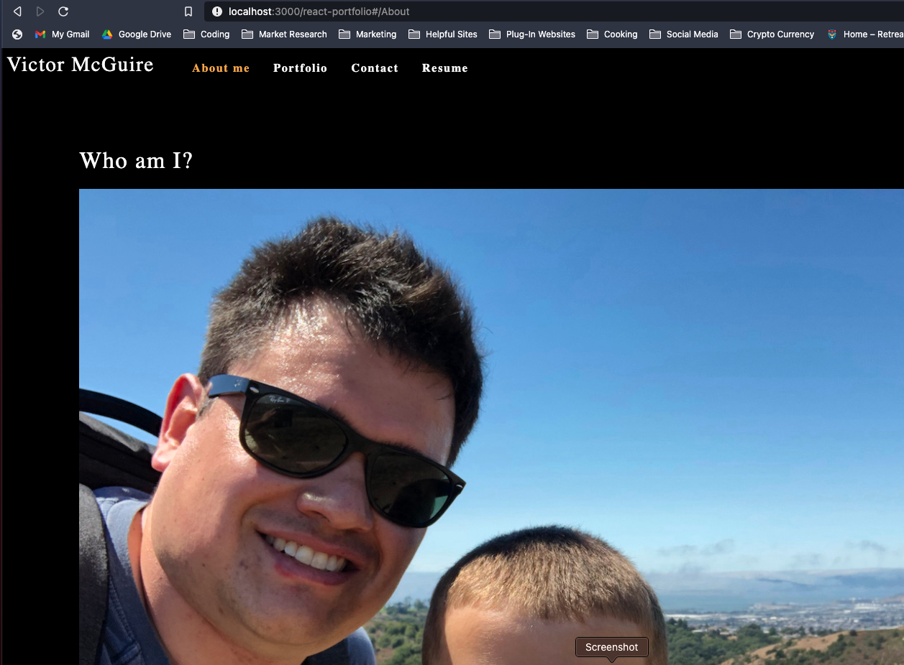
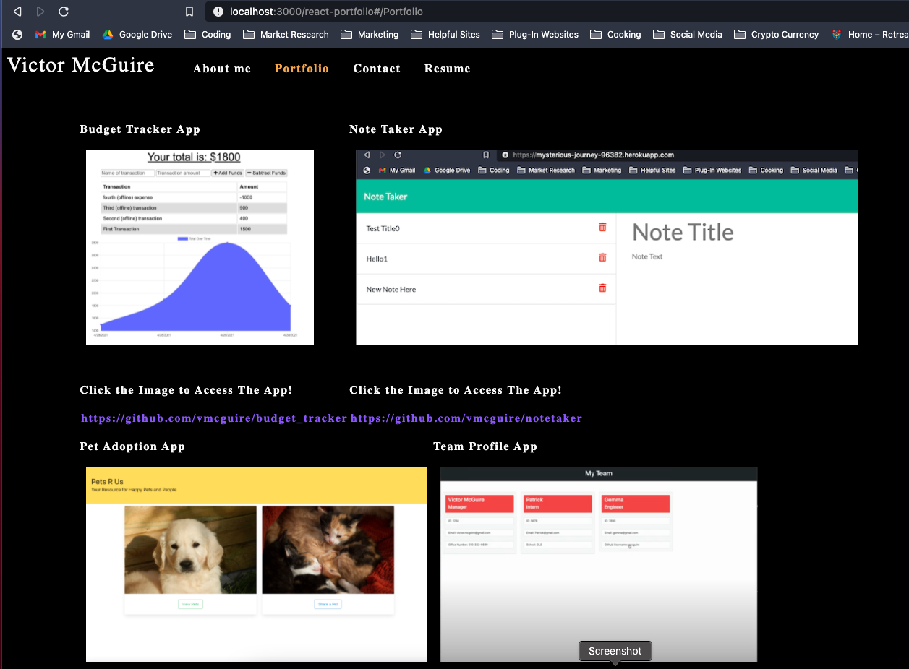

# React Portfolio

## Week 20 Challenge

### Victor McGuire

## Table of Contents

1. [Description](#Description)
2. [Installation Instructions](#Installation-Instructions)
3. [Usage Instructions](#Usage-Instructions)
4. [Questions](#Questions)

## Description

This application is a portfolio of Victor's work to show the experience and projects that have been completed. You can view the work samples by clicking on the photos.

## Installation Instructions

Access the application by accessing it here: https://vmcguire.github.io/react-portfolio/

## Usage Instructions

### Screen Shots Below:

#### Here is the about me section.

#### Here is the Portfolio section. Click the photos to go to the deployed application. The link below goes to the github of each job.

#### Enjoy!

## Questions

Please visit my repo here for any further questions: <https://github.com/vmcguire>

My email address is: <victor.mcguire@gmail.com>
